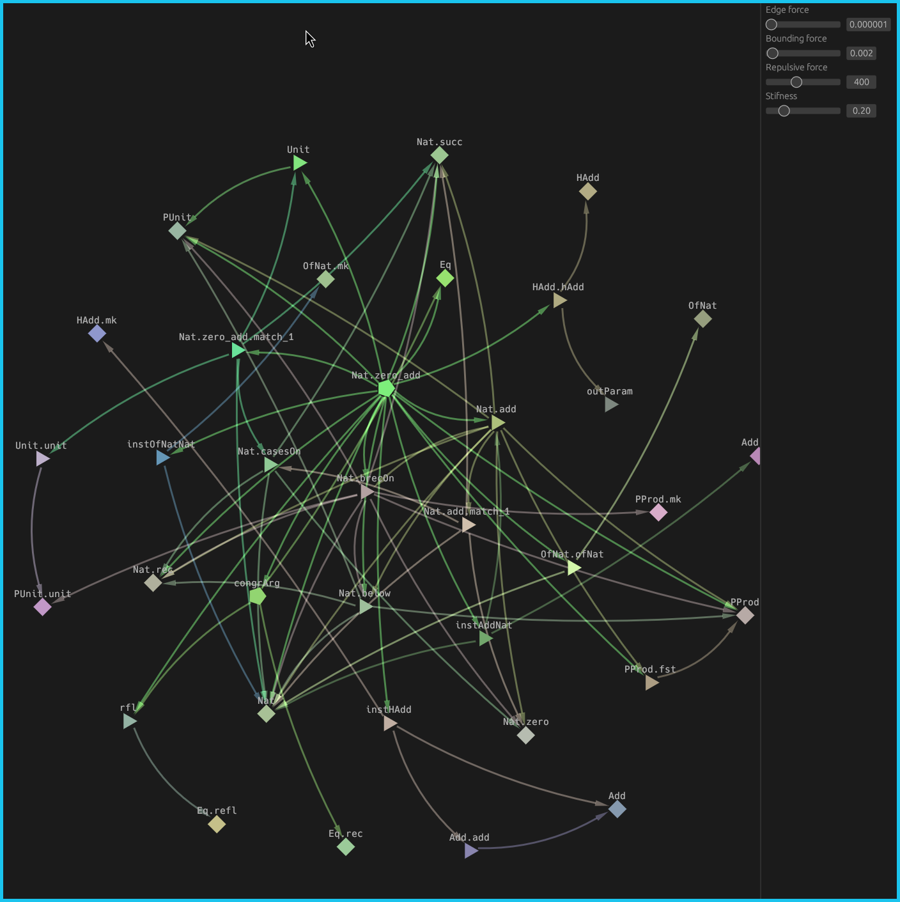
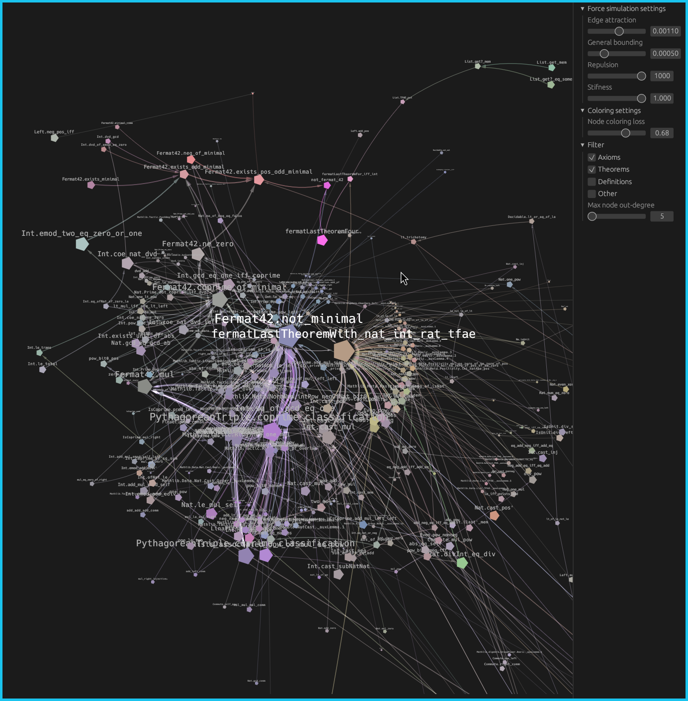

# Lean Graph

Visualization of dependencies for any theorem/definitions in your Lean project.

## How to use

1. Copy the get_graph_meta.lean into your project folder
2. In the top of the file import the files where are the theorems/definitions you want to extract the graph for
3. In the bottom of the file there is an #eval line where you can specify your own custom theorem/definition name
4. Uncomment that same line to get the .json file
5. Run the Rust project using `cargo run --release` or `cargo r` and select your .json file

## What's next

### Visualization improvements - as it is now, it is hard to visualize large theorems without getting lost, improvement of the force graph algorithm but more importantly the coloring and visualization of individual nodes are needed
- Ideally, related theorems and lemmas should be clustered together and have shades of similar colors
- More relevant / larger definitions should be more visible and easier to find
- After selecting a node, user should be able to see more specifically what that node depends on

### Additional features
- After clicking on node, allow for seeing the documentation
- Lazy loading of depending nodes
- Publishing on the web
- Option to visualize any Mathlib constant, without the need of running script locally
